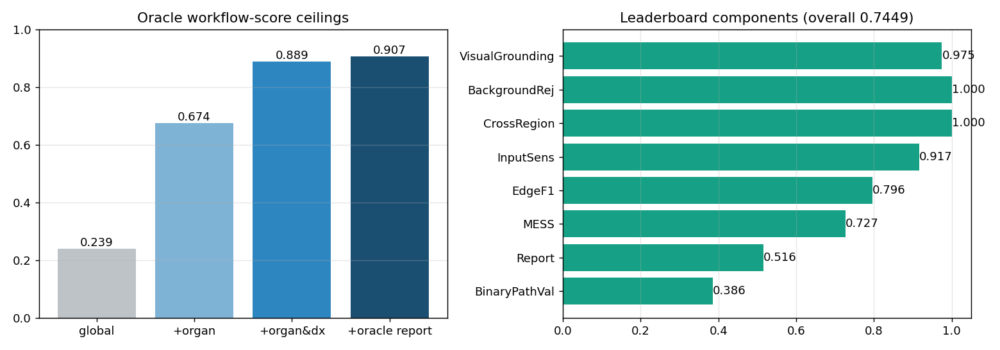
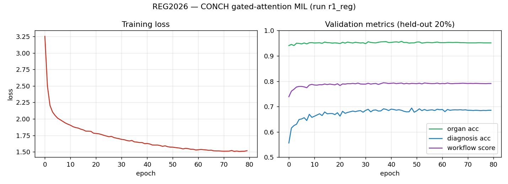

# Results & Training Details

All numbers come from the tracked artifacts under `artifacts/` (per-run `metrics.json` /
`history.json`, `oracle_eval.json`). Figures are regenerated from those artifacts by the snippet
at the bottom of this file.

## Official leaderboard (test phase 1)

**Overall score 0.7449 (top-10).** Scoring:
`Overall = 0.70·A + 0.30·B`, where
`A = 0.05·BPV + 0.30·EdgeF1 + 0.25·MESS + 0.40·Report` and `B = mean(region metrics)`.

| Component | Score | | Component | Score |
|---|---:|---|---|---:|
| Visual Grounding | 0.975 | | Edge F1 | 0.796 |
| Background Rejection | 1.000 | | MESS | 0.727 |
| Cross-Region Consistency | 1.000 | | Report Score | 0.516 |
| Input Sensitivity | 0.917 | | Binary Path Validity | 0.386 |



**Reading the weak metrics.** *Binary Path Validity* is exact edge-set match (all-or-nothing per
case, weight only 0.05), so its low absolute value is by construction and barely moves the score.
The real lever is **Report Score** (weight 0.40 within `A`): the oracle ceiling for the report
sub-score *given correct fields* is **0.805** (below), versus our **0.516** — a ~0.29 gap that a
learned report generator can close. See the report-generator scope in the project notes.

## Oracle ceilings (held-out 20%)

From `artifacts/oracle_eval.json` — upper bounds given perfect intermediate predictions:

| Oracle condition | Total | BPV | Edge F1 | MESS | Report |
|---|---:|---:|---:|---:|---:|
| Global modal (no inputs) | 0.239 | 0.114 | 0.447 | 0.159 | 0.150 |
| + organ | 0.674 | 0.423 | 0.768 | 0.778 | 0.571 |
| **+ organ & diagnosis** | **0.889** | 0.858 | 0.974 | 0.929 | 0.805 |
| + oracle report | 0.907 | 0.858 | 0.974 | 0.929 | — |

The jump from organ→organ&dx confirms **fine-grained diagnosis is the binding constraint**; report
generation has ~0.29 of headroom even with perfect fields.

## Trained MIL ablations (held-out 80/20)

CONCH (frozen, 512-d) tile embeddings → gated-attention MIL → organ + diagnosis heads. From each
run's `metrics.json`:

| Run | Config | Workflow | Organ acc | Dx acc | Best epoch |
|---|---|---:|---:|---:|---:|
| `r0_base` | baseline MIL | 0.791 | 0.951 | 0.682 | 10 |
| `r1_reg` | + regularization | **0.794** | 0.956 | 0.691 | 37 |
| `r1_reg_hier` | + hierarchical dx (inference-time organ masking) | 0.797 | 0.957 | 0.692 | 58 |
| `r2_big` | larger head | 0.793 | 0.953 | 0.683 | 24 |
| `r3_bal` | class-balanced sampling | 0.785 | 0.951 | 0.646 | 44 |
| `r1_reg_full`† | r1 config, **all 11,220 slides** | 0.845† | 0.981† | 0.879† | 74 |

† `r1_reg_full` is the **deployment** model; its reported numbers are **optimistically biased**
because its validation set is a subset of its training set (no held-out). Expect leaderboard
behavior closer to `r1_reg` (~0.79 workflow), not 0.845.

**Takeaways**
- Organ accuracy is effectively solved (~0.96); diagnosis accuracy (~0.69 frozen-CONCH) is the
  bottleneck that caps Edge F1 and MESS.
- Hierarchical dx masking helps only marginally and only at inference (masking in the training loss
  destabilized it). Confidence-based abstention gave no gain (best `tau=0`).
- The real levers from here: (1) **learned report generator** (biggest single gain), then
  (2) diagnosis accuracy via a grading sub-head or CONCH fine-tune.

## Training curves (`r1_reg`)



## Reproducing the figures

```bash
python - <<'PY'
import json, matplotlib; matplotlib.use('Agg')
import matplotlib.pyplot as plt
h = json.load(open('artifacts/mil/r1_reg/history.json'))
ep=[r['epoch'] for r in h]
fig,ax=plt.subplots(1,2,figsize=(11,4))
ax[0].plot(ep,[r['loss'] for r in h]); ax[0].set_title('Training loss')
for k,c in [('organ_acc','g'),('dx_acc','b'),('workflow','m')]:
    ax[1].plot(ep,[r[k] for r in h],label=k)
ax[1].legend(); ax[1].set_title('Validation metrics')
fig.tight_layout(); fig.savefig('report/figures/training_curves.png',dpi=130)
PY
```

The full LaTeX analysis (with TikZ pipeline diagrams, per-organ confusion, and qualitative
examples) is in `report/main.pdf`.
